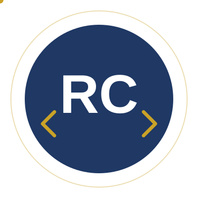

---

### About me

- 🔭 Backend-focused Full-Stack Developer — **2+ years** building REST APIs, JWT auth, and MVC systems with **Node.js, Express, MongoDB**
- 🤖 Building **automation bots** (Python + Selenium) and exploring **AI Engineering** — agentic workflows with Claude Code, Google Antigravity, OpenAI Codex, n8n, Make, and MCP
- 📜 Certified in **Python, Android Development, MERN (online), and industry-level Node.js**; currently pursuing **Data Analytics**
- 💼 Available for **freelance / contract work** and open to full-time backend & full-stack roles
- 🌱 Based in Mumbai, India

---

### Tech stack

**Languages & backend**

**Frontend & mobile**

**Databases & tools**

**AI engineering & automation**

---

### GitHub stats

---

### Contribution snake (animated)

> Setup note: the snake image needs a one-time GitHub Action — see setup instructions below.

---

### Featured projects

| Project | Stack | Link |
|---|---|---|
| Dr. Hasan Health Care Center | MERN | 🟡 add repo/live link |
| School Management System | Node.js · MongoDB · JWT | 🟡 add repo link |
| PradhanJi Portal | Node.js · MongoDB · JWT | 🟡 add repo link |
| Portfolio API | Node.js · MongoDB · JWT | 🟡 add repo link |

---

**Open to freelance projects and full-time backend / full-stack roles — let's talk.**

